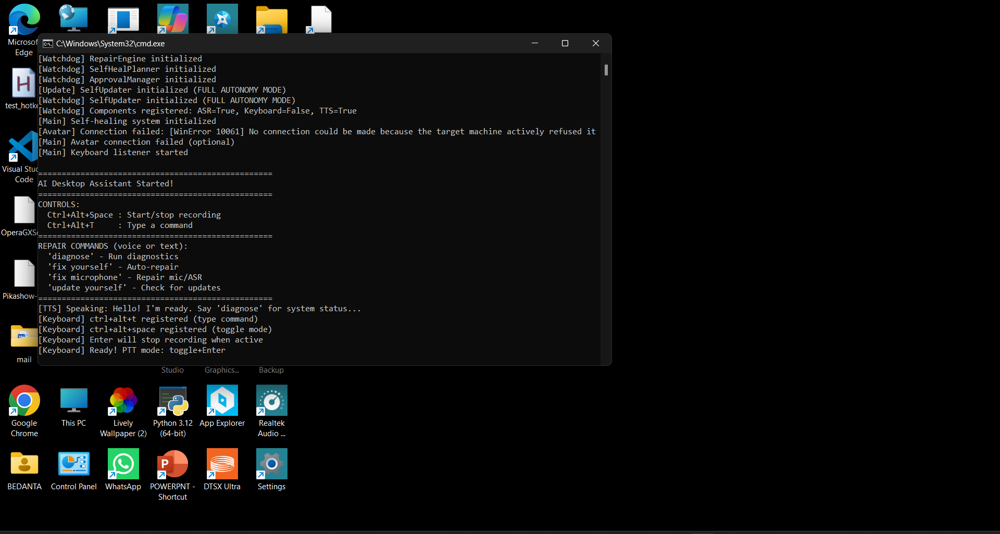

#  AI Desktop Assistant

[](LICENSE)
[](https://www.python.org/downloads/)
[](https://developer.nvidia.com/cuda-toolkit)

**A fully autonomous, voice-controlled AI desktop assistant with self-healing capabilities, powered by local LLMs.**

>  **100% Local & Private** — All processing happens on your machine. No cloud required.



---

##  Key Features

###  Voice Interface
- **Real-time speech recognition** via Whisper (GPU-accelerated)
- **Natural text-to-speech** with Piper voices
- Push-to-talk with configurable hotkeys
- Silence detection and voice activity detection

###  AI Brain (Local LLM)
- **Ollama integration** — runs Mistral, LLaMA, CodeLlama locally
- Zero cloud dependencies for core functionality
- Context-aware conversation memory
- Specialized models for coding tasks

###  Full Autonomy
- **Self-healing system** — detects and repairs its own errors
- Git-backed operations with automatic rollback
- Semantic commit messages for all changes
- Circuit breaker prevents runaway repair loops

###  System Control
- Open applications and websites
- Execute shell commands
- File and folder operations
- Screen reading and automation

###  Live2D Avatar
- VTube Studio integration via OSC
- Lip-sync with audio output
- Emotion-driven animations

---

##  Quick Start

```ash
# 1. Clone the repository
git clone https://github.com/yourusername/ai-desktop-assistant.git
cd ai-desktop-assistant

# 2. Create virtual environment
python -m venv venv
venv\Scripts\activate  # Windows

# 3. Install dependencies
pip install -r requirements.txt

# 4. Configure environment
copy .env.example .env
# Edit .env with your settings

# 5. Install Ollama and pull a model
ollama pull mistral:7b-instruct

# 6. Run the assistant
python core\main_controller.py --tray
```

 **See [INSTALL.md](INSTALL.md) for detailed installation instructions.**

---

##  Hotkeys

| Key | Action |
|-----|--------|
| `Ctrl+Alt+Space` | Start recording (push-to-talk) |
| `Enter` | Stop recording |
| `Ctrl+Alt+T` | Toggle listening mode |
| `Ctrl+Alt+K` | **Kill switch** (emergency stop) |
| `Ctrl+Alt+A` | Toggle avatar visibility |

---

##  Safety First

This assistant has **full system access**. Safety measures include:

- **Kill switch** (`Ctrl+Alt+K`) — instantly stops all operations
- **Circuit breaker** — prevents infinite repair loops (3 attempts/10 min)
- **Git rollback** — all changes can be reverted
- **Disable autonomy** — run `disable_autopilot.bat` for safe mode

 **Read [SAFETY.md](SAFETY.md) before enabling full autonomy.**

---

##  Privacy

-  All speech processing happens **locally**
-  LLM runs on **your hardware** via Ollama
-  No telemetry or analytics
-  Voice recordings stored locally and auto-deleted
-  No cloud APIs required for core features

 **See [PRIVACY.md](PRIVACY.md) for complete data handling policies.**

---

##  Project Structure

```
ai_desktop_assistant/
 main.py              # Entry point
 core/                # Core engine and state
    engine.py        # Main orchestrator
    repair_engine.py # Self-healing system
    state.json       # Persistent state
 speech/              # Voice I/O
    asr.py           # Speech-to-text
    tts.py           # Text-to-speech
 llm/                 # LLM integrations
    ollama_client.py # Ollama API client
 tools/               # System tools and utilities
 logs/                # Runtime logs
```

 **See [ARCHITECTURE.md](ARCHITECTURE.md) for detailed system design.**

---

##  Documentation

| Document | Description |
|----------|-------------|
| [INSTALL.md](INSTALL.md) | Step-by-step installation guide |
| [SAFETY.md](SAFETY.md) | Kill switch and safety features |
| [PRIVACY.md](PRIVACY.md) | Data handling and privacy policy |
| [ARCHITECTURE.md](ARCHITECTURE.md) | System design and data flow |
| [CONTRIBUTING.md](CONTRIBUTING.md) | How to contribute |
| [CHANGELOG.md](CHANGELOG.md) | Version history |

---

##  Requirements

| Component | Minimum | Recommended |
|-----------|---------|-------------|
| **OS** | Windows 10 | Windows 11 |
| **Python** | 3.10 | 3.11+ |
| **RAM** | 8 GB | 16+ GB |
| **GPU** | 4 GB VRAM | 6+ GB VRAM (NVIDIA) |
| **Storage** | 10 GB | 20+ GB (for models) |

---

##  Contributing

Contributions are welcome! Please read [CONTRIBUTING.md](CONTRIBUTING.md) for guidelines.

---

##  License

This project is licensed under the MIT License — see [LICENSE](LICENSE) for details.

---

##  Acknowledgments

- [Whisper](https://github.com/openai/whisper) — Speech recognition
- [Ollama](https://ollama.ai/) — Local LLM runtime
- [Piper](https://github.com/rhasspy/piper) — Text-to-speech
- [VTube Studio](https://denchisoft.com/) — Avatar display

---

<p align="center">
  <b>Built with  for privacy and autonomy</b>
</p>

